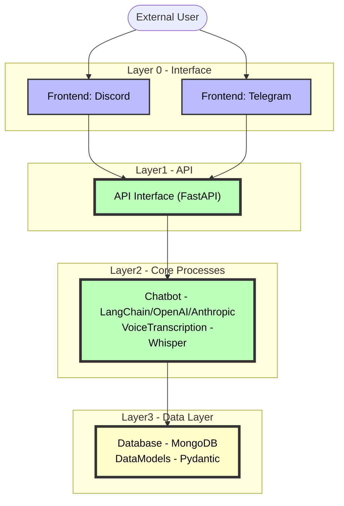

# jonbot

a friendly machine whats nice to talk to 

This is a template repo, clone it and make your own friendo! Or use mine or whatever! No kings, no masters!

This bot helped me build this bot 🤖❤️✨
 

---

JonBot is a chatbot with multiple frontends (Discord, Telegram) powered by AI through [LangChain](https://langchain.readthedocs.io/en/latest/).

## Overview

The codebase is structured into layers:

**Layer 0 - Frontends**: Interface layers to interact with the bot (Discord, Telegram)

**Layer 1 - API Interface**: API route definitions powered by FastAPI 

**Layer 2 - Core Processes**: Main logic for natural language processing and audio transcription

**Layer 3 - Data Layer**: Database and data models

The main entry point is `__main__.py` which starts up the API server and frontend clients.

## Installation

Clone the repo:

```
git clone <repo url>
```

Install dependencies:

```
pip install -r requirements.txt
```

## Setup

- Create a `.env` file with your API keys for OpenAI, Discord, Telegram etc. See `.env.example`
- Run `python -m jonbot` to start the bot

## Usage

- Interact with the bot through Discord/Telegram
- API endpoints provide programmatic access to core functionality
- `__main__.py` starts up all services

## Architecture

**Layer 0 - Frontends**

- `discord_bot`: Discord bot client and event handlers 
- `telegram_bot`: Telegram bot client and handlers

**Layer 1 - API Interface**

- `app.py`: FastAPI application with endpoints

**Layer 2 - Core Processes** 

- `ai_chatbot`: LangChain setup and processing
- `audio_transcription`: Transcribing audio to text with Whisper

**Layer 3 - Data Layer**

- `database`: MongoDB integration
- `data_models`: Pydantic models for data
- `system`: Configuration and utilities