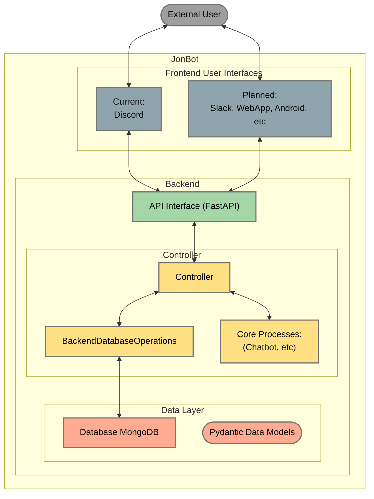

# jonbot

a friendly machine whats nice to talk to

This is a template repo, clone it and make your own friendo! Or use mine or whatever! No kings, no masters!

this bot helped me build this bot!

 🤖❤️✨🎃

---

jonbot is a chatbot with multiple frontends (Discord, Telegram) powered by AI
through [LangChain](https://langchain.readthedocs.io/en/latest/) and connected to a [MongDB](mongodb.com) database.

## Installation

Create and activate an environment:
e.g.

```
conda create -n jonbot-env python=3.11
conda activate jonbot-env
```

Clone the repo:

```
git clone https://github.com/jonmatthis/jonbot
cd jonbot
```

Install dependencies:

```
pip install -e .
```

## Setup

### Building yr Bot Buddy

### Environment Variables

#### Setting up your project `.env` file

- Copy the `sample.env` file and rename it `.env`
- Add all the necessary API keys tokens, etc
    - OpenAI - https://beta.openai.com/docs/developer-quickstart/overview
        - make an OpenAI developer account - https://platform.openai.com/
        - then go to https://platform.openai.com/account/api-keys
        - `Create new API key` - it will look like `sk-<a bunch of letters and numbers >`
        - Copy the key and paste it into the `OPENAI_API_KEY` field in your `.env` file
    - OPTIONAL/RECOMMENDED - LangSmith (Helps you see what's going into and out of your bot's ai brain)
        - Sign up -  https://smith.langchain.com (might be on waitlist?)
        - Make a new project and paste the project ID into the `LANGSMITH_PROJECT` field in your `.env file
        - Make a new API key and copy it into the `LANGSMITH_API_KEY` field in your `.env` file

#### Set up the bot's config `.toml` file

1. Choose a nickname for your bot
    - this can be anything and is only used behind the scenes (e.g. it doesn't affect the bot's displayed Username or
      anything).
    - I recommend something short, all lower case, and ending with the word 'bot', e.g. `jonbot`)


2. Copy this nickname into the `BOT_NICK_NAMES` filed of the `.env` file (if using multiple bots, separate them with a
   comma, e.g. `BOT_NICK_NAMES=jonbot,otherbot,yetanotherbot`)


3. Make a copy of the `/jonbot/system/bot_tomls/_sample_config.toml` file and rename it
   to `[your_bots_nickname]_config.toml`
    - You will fill in the `DISCORD_TOKEN` field after setting up the Discord Application (below)

#### Create a Discord Bot/Application

1. Go to https://discord.com/developers/applications
2. Click `New Application`
3. Give your application a name (this will be the name of your bot)
4. Click `Bot` in the left sidebar
    - Enable `Privileged Gateway Intents` (this is required for the bot to work)
        - Check all three tabs:
            - "Presence Intent"
            - "Server Members Intent"
            - "Message Content Intent"
    - Click `Copy` under `DISCORD_TOKEN` and paste it into the `token` field in your config file
5. Click `OAuth2` in the left sidebar
    - Under `OAuth2 URL Generator`
    - in 'SCOPES' check `bot`
    - in 'BOT PERMISSIONS' check `Administrator` if you're lazy/reckless like me, or check the individual
      permissions you want your bot to have if you're nervous/careful about permissions
    - Copy the URL in the `SCOPES` box and paste it into your browser and invite your bot to your server

## Software

- Install (and run) MongoDB Compass -https://www.mongodb.com/products/tools/compass

- Install (and run) Docker Desktop - https://www.docker.com/products/docker-desktop

- Install `ffmpeg` - https://ffmpeg.org/download.html
    - or `brew install ffmpeg` if you're on a mac
    - or `sudo apt install ffmpeg` if you're on linux
    - or `choco install ffmpeg` if you're on windows (requires chocolatey - https://chocolatey.org/install)

## Run the Bot:

- Create/activate a `python 3.11` environment
- install dependencies: `pip install -e .`
- run: `python -m jonbot.__main__.py`  🤖❤️✨
- The bot should now be running and you should see it online in your Discord server!

### Run with Docker:

- cd into `jonbot/docker`
- run: `docker-compose up --build -d`
- The bot should now be running and you should see it online in your Discord server!

## Usage

- Interact with the bot through Discord (text and voice memos)
- API endpoints provide programmatic access to core functionality
- `__main__.py` starts up all services

## Architecture



**Layer 0 - Frontends**

- `discord_bot`: Discord bot client and event handlers
- `telegram_bot`: Telegram bot client and handlers

**Layer 1 - API Interface**

- `app.py`: FastAPI application with endpoints

**Layer 2 - Core Processes**

- `ai_chatbot`: LangChain setup and processing
- `audio_transcription`: Transcribing audio to text with Whisper

**Layer 3 - Data Layer**

- `database`: MongoDB integration
- `data_models`: Pydantic models for data
- `system`: Configuration and utilities
